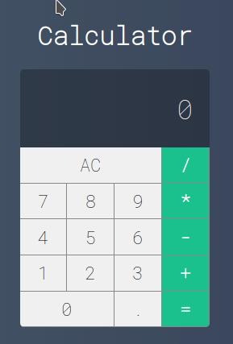

<h1 align="center">
    
</h1>

<p align="center">
 
  


  <a href="https://github.com/tgmarinho/nlw1/commits/master">
    
  </a>


   <a href="https://github.com/tgmarinho/nlw1/stargazers">
    
  </a>
   <a href="https://github.com/tgmarinho/nlw1/stargazers">
    
  </a>
</p>
<p align="center">

  


  

</p>


## Sobre o projeto
Calculator - é uma calculadora básica, baseada em calculadoras de desktop e celulares.

Os usuários encontrarão as seguintes funcionalidades:
- Soma
- Multiplicação
- Divisão
- Subtração
- Resetar calculadora

Os usuários terão acesso ao aplicativo web, onde poderão:
- Realizar operações matemáticas simples e ver seus resultados
- Resetar a calculadora

Projeto desenvolvido para estudar e aprender ReactJS

## Layout

O layout da aplicação está disponível no Figma:

<a href="https://www.figma.com/file/6OMfsJRbh8fVdG8GdsScje/Calculator">
  
</a>

### Web

<p align="center" style="display: flex; align-items: flex-start; justify-content: center;">


  
</p>

## Tecnologias

As seguintes ferramentas foram usadas na construção do projeto:

- [React][reactjs]

## Como executar o projeto

Este projeto está dividido apenas em:
1. FrontEnd

### Pré-requisitos

Antes de começar, você vai precisar ter instalado em sua máquina as seguintes ferramentas:
[Git](https://git-scm.com), [Node.js][nodejs].
Além disto é bom ter um editor para trabalhar com o código como [VSCode][vscode]

### Rodando a aplicação web (Front End)

```bash
# Clone este repositório
$ git clone https://github.com/rafaelabc/calculator

# Acesse a pasta do projeto no terminal/cmd
$ cd calculator

# Instale as dependências
$ yarn install

# Inicie a aplicação
$ yarn start

# A aplicação será aberta na porta:3000 - acesse http://localhost:3000
```

## Licença

Este projeto esta sobe a licença MIT.

Feito por Rafaela Custódio [Entre em contato!](https://www.linkedin.com/in/rafaela-custodio/)

[nodejs]: https://nodejs.org/
[reactjs]: https://reactjs.org
[rn]: https://facebook.github.io/react-native/
[yarn]: https://yarnpkg.com/
[vscode]: https://code.visualstudio.com/
[vceditconfig]: https://marketplace.visualstudio.com/items?itemName=EditorConfig.EditorConfig
[license]: https://opensource.org/licenses/MIT
[vceslint]: https://marketplace.visualstudio.com/items?itemName=dbaeumer.vscode-eslint
[prettier]: https://marketplace.visualstudio.com/items?itemName=esbenp.prettier-vscode
[rs]: https://rocketseat.com.br
